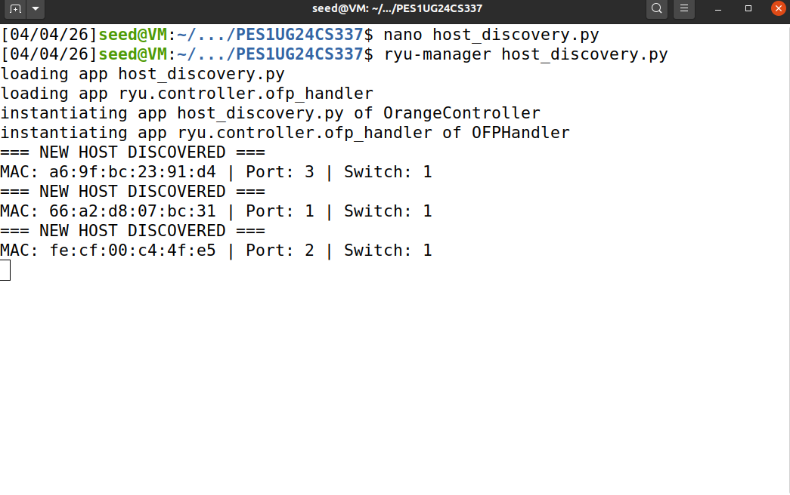
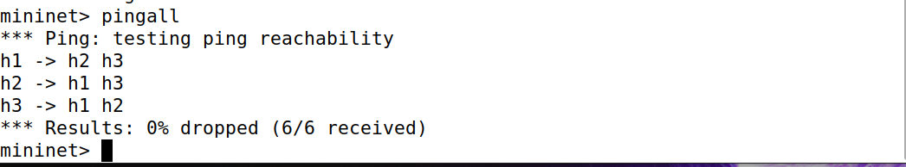
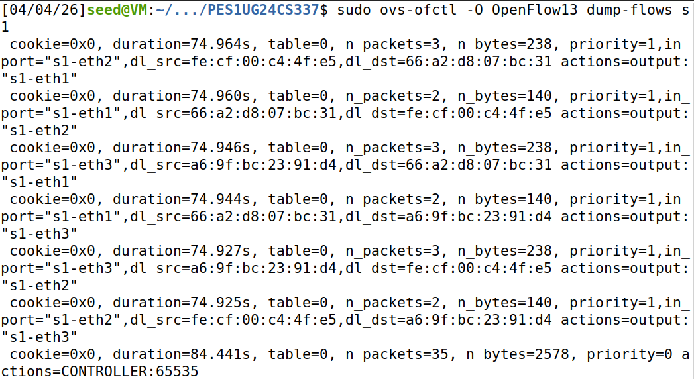
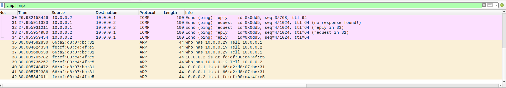

# Host Discovery Service in SDN using Ryu + Mininet
#SDN Mininet Simulation Project – Orange Problem

 # Project Name

**Dynamic Host Discovery Service in Software Defined Networking (SDN) using Ryu Controller and Mininet**

# Problem Statement

In a Software Defined Network, the controller should automatically detect hosts as they join the network and maintain an updated database of active devices.

This project implements a **Host Discovery Service** using:

* Mininet for virtual topology simulation
* Ryu Controller for OpenFlow-based control logic
* Open vSwitch for software switching
* Wireshark for packet behavior verification

The controller dynamically learns:

* Host MAC address
* Connected switch ID
* Ingress port number
* Host communication behavior


# Objectives

* Automatically discover new hosts in SDN topology
* Maintain host MAC → port → switch mapping
* Dynamically update host table
* Install forwarding flow rules
* Validate connectivity using ping
* Verify packet forwarding using Wireshark
* Analyze OpenFlow flow table entries

# Technologies Used

* **Python 3**
* **Ryu SDN Framework**
* **Mininet**
* **Open vSwitch (OVS)**
* **Wireshark**
* **Ubuntu Linux VM**

# System Requirements

* Ubuntu 20.04 / 22.04
* Python 3.x
* Sudo privileges
* Internet inside VM
* VirtualBox / VMware

# Installation Guide

# Update system

```bash
sudo apt update
sudo apt upgrade -y
```

# Install Mininet

```bash
sudo apt install mininet -y
```

## Install Open vSwitch

```bash
sudo apt install openvswitch-switch -y
```

## Install Ryu

```bash
pip3 install ryu
```

#  Verify Mininet

```bash
sudo mn
```

Inside Mininet:

```bash
pingall
```

Exit:

```bash
exit
```

## Verify Ryu

```bash
ryu-manager --version
```


# Project Structure


host-discovery-sdn/
 host_discovery.py
 README.md
 screenshots/
    controller_logs.png
     flow_table.png
    ping.png
       wireshark.png


# Topology Used

Single switch topology with 3 hosts (h1, h2, h3) connected to switch s1.

Command used:

```bash
sudo mn --topo single,3 --controller remote --switch ovsk,protocols=OpenFlow13
```

# How to Run the Project

# Step 1: Run Ryu Controller

```bash
cd <project_folder>
ryu-manager host_discovery.py
```
Screenshot:



# Step 2: Run Mininet in second terminal

```bash
sudo mn --topo single,3 --controller remote --switch ovsk,protocols=OpenFlow13
```
Screenshot:



# Step 3: Test connectivity

Inside Mininet:

```bash
pingall
```
Screenshot:

# Step 4: Dump flow rules

In new terminal:

```bash
sudo ovs-ofctl -O OpenFlow13 dump-flows s1
```
Screenshot:



# Step 5: Wireshark validation

Open Wireshark:

```bash
wireshark
```
Screenshot:


Choose interface: any

Filter:

```text
icmp || arp
```

Generate packets:

```bash
h1 ping -c 4 h2
```

# Features

* Automatic host discovery
* Dynamic host join detection
* MAC learning
* Switch ID and port mapping
* OpenFlow match-action rules
* Dynamic flow installation
* Ping-based validation
* Wireshark packet analysis
* Flow table verification
* Easy scalability for more hosts

# Controller Logic Workflow

1. Host sends first packet
2. Switch sends `packet_in` to controller
3. Controller extracts:

   * source MAC
   * ingress port
   * switch ID
4. Host is added to discovery database
5. Controller installs forwarding rule
6. Future packets are directly forwarded by switch

# Test Scenarios

# Scenario 1: Host Discovery

* Start topology
* Run `pingall`
* Observe new hosts detected in controller log

# Scenario 2: Flow Rule Verification

* Run `dump-flows`
* Verify source-destination MAC rules
* Check output action ports

# Scenario 3: Packet Validation

* Use Wireshark
* Capture ARP + ICMP packets
* Validate echo request/reply

# Expected Output

* New host logs in controller terminal
* Flow rules visible in OVS
* `0% dropped` in pingall
* ICMP + ARP packets visible in Wireshark

# Results

The controller successfully:

* detected all 3 hosts
* dynamically updated host database
* installed MAC-based forwarding rules
* achieved **0% packet loss**
* showed valid ARP + ICMP packets in Wireshark

# Important Commands Used

```bash
ryu-manager host_discovery.py
sudo mn --topo single,3 --controller remote --switch ovsk,protocols=OpenFlow13
pingall
h1 ping -c 4 h2
sudo ovs-ofctl -O OpenFlow13 dump-flows s1
sudo mn -c
wireshark
```

# References

* Mininet Documentation: [https://mininet.org/walkthrough/](https://mininet.org/walkthrough/)
* Ryu Documentation: [https://ryu.readthedocs.io/](https://ryu.readthedocs.io/)

# Author

Pranav SP
SRN: PES1UG24CS337
SECTION: 4F


